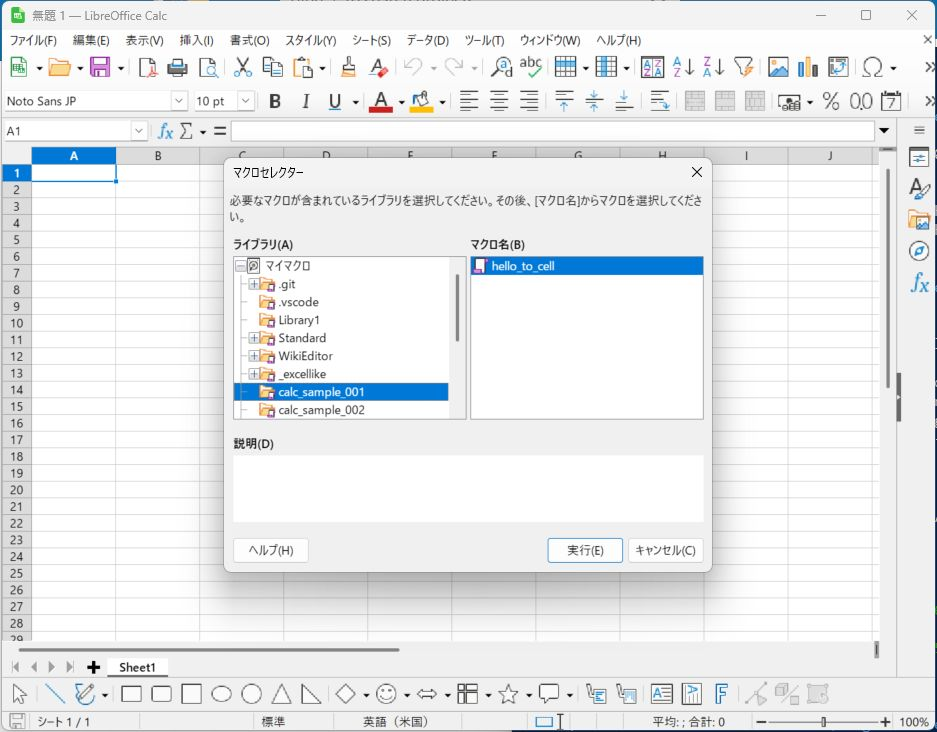

# Excel Like UNO

Provides an Excel/VBA-like programming experience to LibreOffice Calc through a Python wrapper over the UNO API.
The goal is to make migration from Excel macros easier.

[Goto 日本語 README](README.md)

# Key Features

- Hides the complexity of the UNO API and exposes methods/properties close to Excel/VBA
- Wraps Calc concepts (sheets, cells, ranges, shapes, etc.) as Python classes
- Ships rich type hints to support IDE completion and static analysis
- Supports VBA-like code such as `sheet.cell(col, row).value` to help migrate macros

# Prerequisites (Windows)

- LibreOffice installation (e.g. `C:\Program Files\LibreOffice`)
- LibreOffice-bundled Python
  - Executable: `C:\Program Files\LibreOffice\program\python`
- LibreOffice SDK documentation (optional)
  - UNO API reference: `C:\Program Files\LibreOffice\sdk\docs\`

This repository is currently tested on Windows.

# Starting the LibreOffice Server

When controlling Calc/Writer from an external process, first start LibreOffice as a "UNO server":

```powershell
& "C:\Program Files\LibreOffice\program\soffice" `
  --accept="socket,host=localhost,port=2002;urp;" `
  --norestore --nologo
```

With this server running, you can connect from `connect_calc()` or `connect_writer()` to an existing document.

# Installation

A pip package is available (under development):

```powershell
& 'C:\Program Files\LibreOffice\program\python' -m pip install excellikeuno
```

LibreOffice currently bundles Python 3.11, so the package is installed under a user site-packages directory similar to:

```powershell
C:\Users\<UserName>\AppData\Roaming\Python\Python311\site-packages\
```

For local development, clone this repository and add `src` to `PYTHONPATH` instead of using the installed package:

```powershell
git clone <this-repo-url>
cd excellikeuno
$env:PYTHONPATH = "${PWD}\src"
```

## Using LibreOffice from an external script

```powershell
$env:PYTHONPATH=<path-to-excellikeuno>
& 'C:\Program Files\LibreOffice\program\python' <script-file>
```

Make sure that the Python executable is the one bundled with LibreOffice.
Other Python environments usually do not have the UNO modules installed and will fail.

It is convenient to have a helper script like `samples/xluno.ps1` adjusted to your environment:

```powershell
param(
    [string]$scriptfile = '.'
)
$env:PYTHONPATH='..\src\'
& 'C:\Program Files\LibreOffice\program\python' $scriptfile
```

## Using from LibreOffice internal macros

First, install the package with the LibreOffice-bundled Python:

```powershell
& 'C:\Program Files\LibreOffice\program\python' -m pip install excellikeuno
```

Alternatively, you can place this library directly under:

```powershell
C:\Users\<UserName>\AppData\Roaming\LibreOffice\4\user\Scripts\python\
```

The library provides a helper `connect_calc_script()` that uses `XSCRIPTCONTEXT` to connect to the active Calc document.  
Register your macro function in `g_exportedScripts` so that it appears under "Tools" → "Macros" → "Run Macro":

```python
from typing import Any, Tuple
from excellikeuno.table.sheet import Sheet
from excellikeuno import connect_calc_script

def hello_to_cell():
  (_, _, sheet) = connect_calc_script(XSCRIPTCONTEXT)
  sheet.cell(0, 0).text = "Hello Excel Like for Python!"
  sheet.cell(0, 1).text = "こんにちは、Excel Like for Python!"
  sheet.cell(0, 0).column_width = 10000  # set width

  cell = sheet.cell(0, 1)
  cell.CellBackColor = 0x006400  # dark green
  cell.CharColor = 0xFFFFFF  # white text

g_exportedScripts = (
  hello_to_cell,
)
```




To enable code completion in VS Code, add the following to `.vscode/settings.json`
(adjust the path to your user name and Python version):

```json
{
  // existing settings...

  "python.analysis.autoImportCompletions": true,
  "python.analysis.extraPaths": [
    "C:/Users/masuda/AppData/Roaming/Python/Python311/site-packages"
  ]
}
```

## Using on Linux

(Work in progress)

Installation on Linux is relatively straightforward using distribution packages.

```bash
sudo apt install libreoffice
sudo apt install python3-uno
```

Start the UNO server:

```bash
soffice --accept="socket,host=localhost,port=2002;urp;" --norestore --nologo
```

On Linux, headless (no GUI) mode is available and convenient when controlling LibreOffice via the UNO API.
This can be extended to run a LibreOffice server inside WSL or Docker containers.

## Using with WSL

(Work in progress)

## Using with Docker containers

(Work in progress)

# Usage Overview

## Connect to Calc and work with cells

```python
from excellikeuno import connect_calc

desktop, doc, sheet = connect_calc()

sheet.cell(0, 0).value = 100    # A1
sheet.cell(1, 0).value = 200    # B1
sheet.cell(2, 0).formula = "=A1+B1"  # C1
```

## Connect to Writer and write text

```python
from excellikeuno import connect_writer

desktop, doc = connect_writer()
text = doc.text
text.setString("Hello, LibreOffice Writer!")
```

Sample code is under `samples/` and can be run via `xluno.ps1`:

```powershell
cd samples
./xluno.ps1 ./calc_sample_cell.py
./xluno.ps1 ./calc_sample_shogiban.py
./xluno.ps1 ./writer_sample_text.py
```

# Development with VS Code

- Enable the Python extension and PowerShell extension
- To run tests, use the Command Palette or "Run Task" and choose:
  - `Test (LibreOffice Python)`

The task uses the LibreOffice-bundled Python to run `pytest tests`.

# Running Tests

Start the LibreOffice server first, then from the repository root run:

```powershell
# Start server
& "C:\Program Files\LibreOffice\program\soffice" --accept="socket,host=localhost,port=2002;urp;" --norestore --nologo

# Run tests (same as the VS Code task)
$env:PYTHONPATH='H:\LibreOffice-ExcelLike\src\'
& 'C:\Program Files\LibreOffice\program\python' -m pytest tests
```

# Documentation / UNO API Reference

- Project design and specs live under `agents/`:
  - Class design: `agents/class_design.md`
  - Coding rules: `agents/coding_rule.md`
  - Design guidelines: `agents/design_guidelines.md`
  - Test execution: `agents/test_execution.md`
- UNO API reference (local installation):
  - `C:\Program Files\LibreOffice\sdk\docs\`

# Version

- 0.1.1 (2025-01-06): Built pip package
- 0.1.0 (2025-01-05): Pre-release

# License

MIT License

# Author

Tomoaki Masuda (GitHub: @moonmile)
