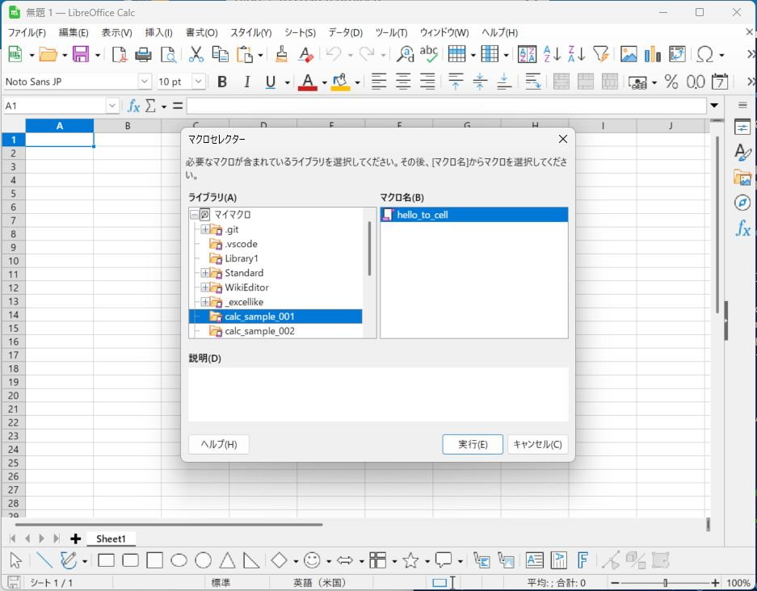
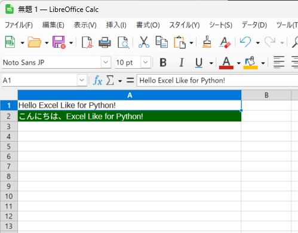

git clone <this-repo-url>
# Excel Like UNO

Provides an Excel/VBA-like programming experience to LibreOffice Calc through a Python wrapper over the UNO API. The goal is to make migration from Excel macros easier.

[Goto 日本語 README](README.md)

# Key Features

- Hide the complexity of the UNO API and expose methods/properties close to Excel/VBA
- Wrap Calc concepts (sheets, cells, ranges, shapes, etc.) as Python classes
- Ship rich type hints to support IDE completion and static analysis
- Support VBA-like code such as `sheet.cell(col, row).value` to help migrate macros

# Prerequisites (Windows)

- LibreOffice installation (e.g. `C:\Program Files\LibreOffice`)
- LibreOffice-bundled Python
  - Executable: `C:\Program Files\LibreOffice\program\python`
- LibreOffice SDK documentation (optional)
  - UNO API reference: `C:\Program Files\LibreOffice\sdk\docs\`

This repository is currently tested on Windows.

# Starting the LibreOffice Server

When controlling Calc/Writer from an external process, first start LibreOffice as a "UNO server":

```powershell
& "C:\Program Files\LibreOffice\program\soffice" `
  --accept="socket,host=localhost,port=2002;urp;" `
  --norestore --nologo
```

With this server running, you can connect from `connect_calc()` or `connect_writer()` to an existing document.

# Installation

A pip package is available (under development):

```powershell
& 'C:\Program Files\LibreOffice\program\python' -m pip install excellikeuno
```

LibreOffice currently bundles Python 3.12, so the package is installed under a user site-packages directory similar to:

```powershell
C:\Users\<UserName>\AppData\Roaming\Python\Python312\site-packages\
```

For local development, clone this repository and add `src` to `PYTHONPATH` instead of using the installed package:

```powershell
git clone <this-repo-url>
cd excellikeuno
$env:PYTHONPATH = "${PWD}\src"
```

## Using LibreOffice from an external script

```powershell
$env:PYTHONPATH=<path-to-excellikeuno>
& 'C:\Program Files\LibreOffice\program\python' <script-file>
```

Make sure that the Python executable is the one bundled with LibreOffice. Other Python environments usually do not have the UNO modules installed and will fail.

It is convenient to have a helper script like `samples/xluno.ps1` adjusted to your environment:

```powershell
param(
    [string]$scriptfile = '.'
)
$env:PYTHONPATH='..\src\'
& 'C:\Program Files\LibreOffice\program\python' $scriptfile
```

## Using from LibreOffice internal macros

First, install the package with the LibreOffice-bundled Python:

```powershell
& 'C:\Program Files\LibreOffice\program\python' -m pip install excellikeuno
```

Alternatively, place this library directly under:

```powershell
C:\Users\<UserName>\AppData\Roaming\LibreOffice\4\user\Scripts\python\
```

The library provides `connect_calc_script()`, which uses `XSCRIPTCONTEXT` to connect to the active Calc document. Add your macro function to `g_exportedScripts` so it is visible under "Tools" → "Macros" → "Run Macro":

```python
from excellikeuno import connect_calc_script

def hello_to_cell():
    (_, _, sheet) = connect_calc_script(XSCRIPTCONTEXT)
    sheet.cell(0, 0).text = "Hello Excel Like for Python!"
    sheet.cell(0, 1).text = "こんにちは、Excel Like for Python!"
    sheet.cell(0, 0).column_width = 10000  # set width

    cell = sheet.cell(0, 1)
    cell.backcolor = 0x006400  # dark green
    cell.color = 0xFFFFFF      # white text

g_exportedScripts = (
    hello_to_cell,
)
```





To enable code completion in VS Code, add the following to `.vscode/settings.json` (adjust the path to your user name and Python version):

```json
{
    "python.analysis.autoImportCompletions": true,
    "python.analysis.extraPaths": [
        "C:/Users/masuda/AppData/Roaming/Python/Python312/site-packages"
    ]
}
```

## Using on Linux

Work in progress, but installation on Linux is relatively straightforward using distribution packages.

```bash
sudo apt install libreoffice
sudo apt install python3-uno
```

Start the UNO server:

```bash
soffice --accept="socket,host=localhost,port=2002;urp;" --norestore --nologo
```

On Linux, headless (no GUI) mode is available and convenient when controlling LibreOffice via the UNO API. You can also run the LibreOffice server inside WSL or Docker.

For Python macros, install the package into the OS Python environment. Example on Ubuntu 20.04 + Python 3.12 (create any working folder such as `~/libre`):

```bash
mkdir libre
cd libre
python -m venv .venv
.venv/bin/pip install excellikeuno
ls .venv/lib/python3.12/site-packages
sudo cp -r ~/libre/.venv/lib/python3.12/site-packages/excellikeuno /usr/lib/python3/dist-packages/
```

## Using with WSL

Work in progress

## Using with Docker containers

Work in progress

# Usage Overview

## Connect to Calc and work with cells

```python
from excellikeuno import connect_calc
from excellikeuno.typing.calc import CellHoriJustify, CellVertJustify

(desktop, doc, sheet) = connect_calc()
cell = sheet.cell(0, 0)  # A1
cell.text = "Hello, World!"
sheet.range("A1:C1").merge(True)

cell.font.size = 16
cell.font.name = "Arial"
cell.font.color = 0xFF0000  # red text

cell.row_height = 2000  # 20 mm
cell.HoriJustify = CellHoriJustify.CENTER
cell.VertJustify = CellVertJustify.CENTER

sheet.cell(0, 1).text = "id"
sheet.cell(1, 1).text = "name"
sheet.cell(2, 1).text = "address"
sheet.range("A2:C2").CellBackColor = 0xFFBF00  # header background

data = [
    [1, "masuda", "tokyo"],
    [2, "suzuki", "osaka"],
    [3, "takahashi", "nagoya"],
]
sheet.range("A3:C5").value = data  # bulk assign
```

## Create, save, and reopen Calc documents

```python
from pathlib import Path
from excellikeuno import new_calc_document, open_calc_document, active_document, active_sheet

out_path = Path("C:/temp/excellikeuno_save.ods")

# Create and save
_, doc, sheet = new_calc_document(hidden=True)
sheet.cell(0, 0).value = 100
sheet.cell(1, 0).text = "saved"
doc.save_as(str(out_path))
doc.save_copy(str(out_path.with_stem("excellikeuno_save_copy")))

# Re-open (hidden/read_only/as_template/filter_name are available)
_, reopened_doc, reopened_sheet = open_calc_document(str(out_path), hidden=True)
print(reopened_doc.has_location, reopened_doc.is_modified)

# Access the UI-active document/sheet
active_doc = active_document()
active_sheet_handle = active_sheet()

# Add/copy/remove sheets
doc = active_doc
added = doc.add_sheet("CopiedSheet")
doc.copy_sheet(added.name, "CopiedSheet2")
doc.remove_sheet("CopiedSheet2")
doc.remove_sheet("CopiedSheet")
```


## Draw borders in Calc

```python
# sample chessboard
import uno
from excellikeuno import connect_calc
from excellikeuno.drawing.shape import Shape 
from excellikeuno.sheet import Cell

(desktop, doc, sheet) = connect_calc()

# sheet.name = "chess board"

ban = sheet.range("A1:H8")
ban.row_height = 1000  # row height 10 mm
ban.column_width = 1000  # column width 10 mm
colors = [0xFFFFFF, 0x000000]
for r in range(8):
    for c in range(8):
        cell = ban.cell(c, r)
        # cell.CellBackColor = colors[(r + c) % 2]
        cell.horizontal_align = 2 # CENTER
        cell.vertical_align = 2 # CENTER
        piece = ""
        if r == 0 or r == 7:
            piece = "♜♞♝♛♚♝♞♜"[c]
        elif r == 1 or r == 6:
            piece = "♟"[0] 
        cell.value = piece
        cell.font.size = 20
        cell.font.name = "Arial Unicode MS"
        if 0 <= r <= 2:
            cell.font.color = 0xFFFFFF

# make RectangleShape, display to background by bitmap
shape_white = sheet.shapes.add_rectangle_shape(
    x=0,
    y=0,
    width=1000,
    height=1000 )
shape_white.fill.bitmap_name = "Concrete"

shape_black = sheet.shapes.add_rectangle_shape(
    x=1000,
    y=1000,
    width=1000,
    height=1000 )
shape_black.fill.bitmap_name = "Parchment Paper"

def copy_behind(cell : Cell, shape: Shape):

    x = cell.position.X
    y = cell.position.Y
    w = cell.column_width
    h = cell.row_height
    shape_copy = sheet.shapes.add_rectangle_shape(x,y, w, h )
    shape_copy.fill.style = shape.fill.style
    shape_copy.fill.bitmap_name = shape.fill.bitmap_name
    # set background by dispatcher call
    shape_copy.to_background()

    return shape_copy

# set shape_white and shape_back to sheet.range("A1:H8") 
for r in range(8):
    for c in range(8):
        cell = ban.cell(c, r)
        if (r + c) % 2 == 0:
            copy_behind(cell, shape_white)
        else:
            copy_behind(cell, shape_black)

# delete the original shape_white and shape_black
sheet.shapes.remove(shape_white)
sheet.shapes.remove(shape_black)
```


Sample code is under `samples/` and can be run via `xluno.ps1`:

```powershell
cd samples
./xluno.ps1 ./calc_sample_cell.py
./xluno.ps1 ./calc_sample_chessboard.py
./xluno.ps1 ./writer_sample_text.py
```

# Development with VS Code

- Enable the Python extension and PowerShell extension
- To run tests, use the Command Palette or "Run Task" and choose `Test (LibreOffice Python)`

The task uses the LibreOffice-bundled Python to run `pytest tests`.

Recommended flow:
- Start the UNO server (see above)
- Ensure `PYTHONPATH` includes `src`
- Run the `Test (LibreOffice Python)` task or the equivalent command below

# Running Tests

Start the LibreOffice server first, then from the repository root run:

```powershell
# Start server
& "C:\Program Files\LibreOffice\program\soffice" --accept="socket,host=localhost,port=2002;urp;" --norestore --nologo

# Run tests (same as the VS Code task)
$env:PYTHONPATH='H:\LibreOffice-ExcelLike\src\'
& 'C:\Program Files\LibreOffice\program\python' -m pytest tests
```

# Documentation / UNO API Reference

- Project design and specs live under `agents/` (single source of truth):
  - `agents/class_design.md` (class responsibilities)
  - `agents/design_guidelines.md` (wrapping patterns and naming rules)
  - `agents/folder_structure.md` (module layout)
  - `agents/naming_rules.md` (Calc naming conventions; stub)
  - `agents/operation_spec.md` (Calc operation spec; stub)
  - `agents/tasks.md` (work items for agents)
  - `agents/test_execution.md` (how to run tests/headless modes)
- UNO API reference (local installation):
  - `C:\Program Files\LibreOffice\sdk\docs\`

## Blog

- [Using ExcelLikeUno with LibreOffice Calc on Linux | Moonmile Solutions Blog](https://www.moonmile.net/blog/archives/11933)

# Version

- 0.3.0 (2026-03-07): Internally renamed wrappers (Sheet/Range/Cell -> Spreadsheet/SheetCellRange/SheetCell) and cleaned up CellProperties-related APIs
- 0.2.0 (2025-01-09): Added `font` on Cell/Range/Shape and `borders` on Cell/Range
- 0.1.1 (2025-01-06): Built pip package
- 0.1.0 (2025-01-05): Pre-release

# License

MIT License

# Author

Tomoaki Masuda (GitHub: @moonmile)
