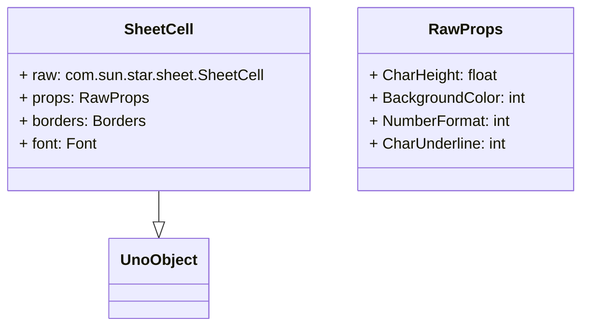

# クラス構造のリファクタリング

## 目的

- Uno API の .idl から .pyi を生成する
- コーディング時に com.sun.star 以降のクラスを型チェックできるようにする
- XCell, CellProperties をひとまとめにして Cell クラスにする
- cell.borders.all.weight = 50 のように、Excel VBA ライクに構成し直す

## 進め方

### .idl から .pyi を生成

tools/idl_to_pyi.py を実行して、.idl から .pyi を生成する

```bash
python tools/idl_to_pyi.py
```

- offapi/com/ 以下の .idl を利用する
- .pyi にするときは、パッケージ単位にまとめる
- 出力レイアウト方針: 出力ルートを src/stubs とし、IDL のモジュール構造をそのままミラー（例: com/sun/star/sheet/XCell.idl → src/stubs/com/sun/star/sheet/XCell.pyi）。各ディレクトリに __init__.pyi を生成して同階層シンボルを集約する。IDE から解決できるよう PYTHONPATH には src と src/stubs を追加する。
- tools/idl_to_pyi.py は SDK ツール非依存のカスタムパーサで、--idl-root (デフォルト offapi/com) と --out-root (デフォルト src/stubs) を指定可能。生成後、必要なら VS Code をリロードして Pylance のキャッシュをクリアする。
- 足りない .pyi は src/stubs-add/com/... に追加してある XInterface など


### excellikeuno/table/cell.py のリファクタリング

excellikeuno/table/cell.py を sutbs を使ってリファクタリングする
XCell, CellProperties をひとまとめにして Cell クラスにする
- スタブ (src/stubs) を直接 import して型付けする。InterfaceNames はクエリ用定数に限定し、typing/calc からの import は順次削除する。

### SheetCell の作成

Excel ライクなアクセス方法

```python
cell = sheet.sheet_cell(0, 0)
cell.borders.top.color = 0xFF0000
cell.font.size = 12
cell.back_color = 0xFFFF00
```

UNO API 経由でアクセスする方法

```python
cell.raw.setPropatyValue("CharHeight", 12 )
cell.raw.setPropatyValue("BackgroundColor", 0xFFFF00)
cell.raw.setPropatyValue("NumberFormat", 0)
cell.raw.setPropatyValue("CharUnderline", 0)
```

props 経由でアクセスする方法
- raw.setPropertyValue, raw.getPropertyValue を内部で呼び出す。

```python
cell.props.CharHeight = 12
cell.props.BackgroundColor = 0xFFFF00
cell.props.NumberFormat = 0
cell.props.CharUnderline = 0
```

- 既存の proxy である Font, Borders クラスはそのまま利用する



RawProps は、SheetCell が持つ

- CharacterProperties
- ParagraphProperties
- TextProperties
- FormulaProperties

などをまとめるクラスとして作成する

```pthyon
def collect_properties(obj):
    props = []
    for ps in collect_property_sets(obj):
        info = ps.getPropertySetInfo()
        for p in info.getProperties():
            props.append((p.Name, p.Type))
    return props
```
